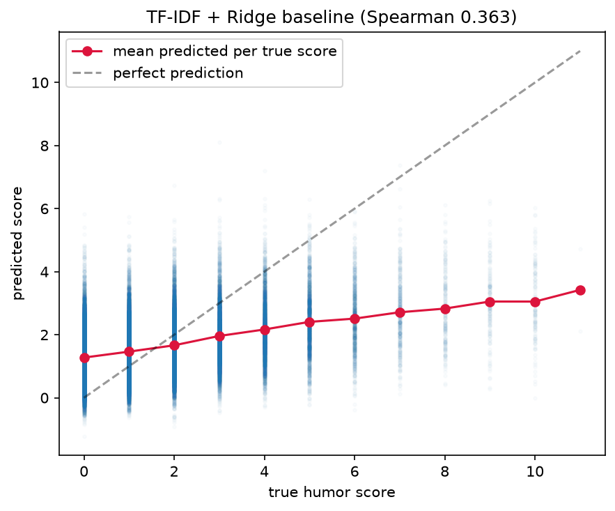
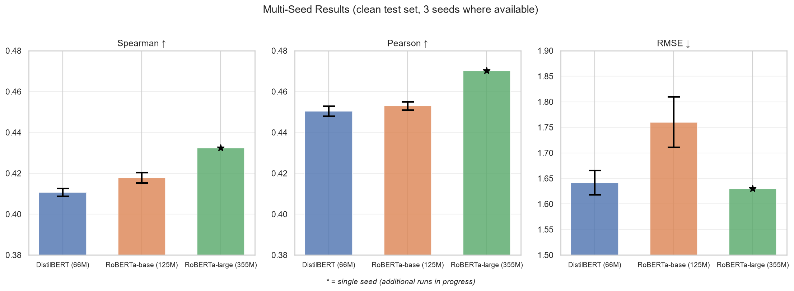

# Project Log

An engineering narrative written to document the process of building this project, 
because the debugging is where most of the real learning happened.

---

## 1. Goal and scope

Build an NLP project on computational humor using only free compute (local CPU,
Kaggle GPUs). A ladder of models that predict how funny a joke is,
benchmarked against a classical baseline and compared to a published paper's
results, followed by a full analysis of where the models work and where they
fail.

## 2. Dataset choice

Selected **rJokes** (Weller & Seppi, LREC 2020) which is a collection of 573k Reddit
r/Jokes posts with humor-score labels because
it is large, published as a benchmark with prior baselines to compare against.
The paper filtered this to ~432k jokes for their regression task (removing
pre-2016 jokes to normalize scores across community growth periods), and
provided train/dev/test splits.

### The label is already log-scaled

The `score` column is not the raw Reddit upvote count. The dataset authors
applied `round(ln(raw_score + 1))`, compressing raw scores, which peak at
~136k upvotes, not "millions" as I initially assumed, into integers. The paper
reports the range as 0–10, but the data actually reaches 11 for the
highest-scoring jokes (the 11 bar is vanishingly small and barely visible in
histograms, which is likely why the paper rounds to 0–10). The `describe()`
output confirmed `max = 11`.

Initial EDA had been log-transforming an already-log-transformed value (a double
transform). Fixed by using the label directly as the regression target. This
shaped the rest of the modeling.

## 3. Data cleaning

Manual inspection of top/bottom-scoring jokes surfaced data-quality issues that
a naive pipeline would miss. Quantified and handled:

- **Exact duplicates:** 5,707 in train (1.65%). Reddit reposts. Removed.
- **Ultra-short / title-only entries:** ~0.2% at a <5-word threshold (junk like
  "Classic", "Title", emoji-only) removed.
- **Cross-split leakage:** ~2.4% of dev/test jokes were exact copies of training
  jokes.

Cleaned split sizes: **339,499 train / 41,941 dev / 41,957 test.** Class balance
was checked before and after cleaning and barely shifted, confirming
cleaning removed junk without distorting the target.

## 4. Cross-split leakage

This turned out to be the most important data-quality issue. Checking dev/test
jokes against the cleaned training set revealed exact duplicates:

| Split | Leaked rows | Leak rate |
|---|---|---|
| Dev | 1,044 / 42,985 | 2.4% |
| Test | 1,061 / 43,018 | 2.5% |

Evaluating on these would test memorization, not generalization. The prior
paper does not remove this overlap.

The fix was straightforward (`remove_leakage()` in `data.py`). The question as to how much it
matters required building the evaluation script first.

### Quantifying the leakage impact

After training, every model was evaluated on three test-set variants:
- **Clean:** leakage removed (41,957 rows)
- **Leaky:** leakage left in (43,018 rows, matching the paper's condition)
- **Leaked-only:** just the 1,061 overlapping rows

The inflation from leakage turned out to be real but small: ~0.008 Spearman
on average across models. This reframed the project's narrative. The earlier
hypothesis was that the paper's numbers were significantly inflated but the data
showed a measurable but slight effect.
The leaked-only rows did show elevated Spearman (~0.49–0.50 vs ~0.41–0.43 for
the full set) but worse RMSE (~2.22 vs ~1.63–1.70), confirming they are
high-scoring viral reposts that the model ranks well but underestimates in
magnitude.

## 5. Baseline: TF-IDF + Ridge

Built a baseline to establish the number every transformer must beat.
An initial run with a capped vocabulary (20k features) scored Spearman 0.302.
Testing vocabulary size showed the cap was costing real accuracy:

| Vocabulary | Test Spearman |
|---|---|
| Capped 20k | 0.302 |
| Capped 100k | 0.346 |
| Uncapped (min_df=5) | 0.363 |

Memory stayed ~150 MB even uncapped (sparse matrices), so the cap was
unnecessary. Final baseline: **Spearman 0.363, Pearson 0.414, RMSE 1.645**.

## 6. Training protocol

I made the decision to build a single training routine (`src/train.py`) with a
fixed protocol in the early stages, so all transformer results become directly comparable.
This made the experimental design tighter. The protocol:

- 5 epochs, best checkpoint by dev Spearman
- Effective batch size 32, constant across platforms
- LR 2e-5, 6% linear warmup, weight decay 0.01
- Max sequence length 128 tokens, fp16, seed 42
- Evaluation once per epoch

The per-device batch and gradient accumulation
adapt to the GPU count, but the number of gradient updates is identical.

### The multi-GPU batch size confound

Kaggle provides 2× T4 GPUs. Hugging Face's Trainer splits each batch across
both, so `per_device_batch=32` becomes an effective batch of 64. Larger
batches = fewer steps per epoch = fewer gradient updates = an undertrained
model. In the first version of this project, this silently invalidated
a 128-vs-256 token comparison as the two runs differed in both context
length & update count.

Training logs were reviewed to diagnose this issue and I found `339,499 / 64 ≈ 5,305 steps/epoch` vs the expected `339,499 / 32 ≈ 10,610`. I thus wrote a training harness `train.py` to resolve this automatically
by computing `per_device_batch = EFFECTIVE_BATCH // n_gpus` and adding gradient
accumulation if needed, guaranteeing the same step count everywhere.

## 7. Fine-tuning: DistilBERT (66M)

The lightweight rung of the ladder. Trained on Kaggle T4 ×2, ~7 hours.

Training peaked at epoch 3 (dev Spearman 0.4114) and declined through
epochs 4–5 (overfitting).

Test results (clean): **Spearman 0.4118, Pearson 0.4513, RMSE 1.6426.**

### Bugs fixed

- **`RuntimeError: Found dtype Long but expected Float`.** Regression loss (MSE)
  needs float labels, but integer scores were being cast back to `Long`. Fixed
  with `dataset.cast_column("labels", Value("float32"))`, which forces the type
  at the schema level.
- **The DistilBERT "MISSING / UNEXPECTED" load report.** Expected and correct:
  the pretraining head is discarded, the new regression head is initialized
  fresh. This is normal for any fine-tune.

## 8. Fine-tuning: RoBERTa-base (125M)

The mid-size rung. Trained on Kaggle T4 ×2, ~7 hours.

I found the same overfitting pattern. It peaked at epoch 3 (dev Spearman 0.4208), declined
at 4–5.

Test results (clean): **Spearman 0.4187, Pearson 0.4510, RMSE 1.7047.**

Note: RoBERTa-base has worse RMSE (1.705) than DistilBERT
(1.643) despite higher Spearman. It ranks jokes better but its magnitude
predictions are less accurate. The ranking (Spearman) and calibration (RMSE)
metrics tell different stories.

## 9. Fine-tuning: RoBERTa-large (355M)

The match-the-paper rung. This was the most infrastructure-intensive run.

### The session-limit problem

RoBERTa-large at 128 tokens, effective batch 32, on Kaggle T4 ×2 runs at
~0.68 updates/s. At 10,610 steps/epoch × 5 epochs = 53,050 updates, the full
run needs ~22 hours which is far beyond Kaggle's 12-hour session limit.

Initial attempt to use `per_device_override=8` (with `grad_accum=2`) was even
slower (~0.59 updates/s, ~25h ETA) because the smaller batch couldn't saturate
the GPU, and each update required two forward/backward passes.

Switching to `per_device_override=16` (no accumulation) was faster and the
model fit in T4 memory at fp16. But it still needed ~13h for 3 epochs.

The Trainer's checkpoint-resume mechanism (`get_last_checkpoint` +
`resume_from_checkpoint`) preserves optimizer state and LR schedule so
splitting across sessions is mathematically identical to a single continuous
run.

- **Session 1:** epochs 1–2 completed, timed out during epoch 3. Checkpoints
  survived in Kaggle's `/kaggle/working/` output.
- **Sessions 2–3:** output from each prior session was downloaded, the latest
  checkpoint extracted and re-uploaded as a private Kaggle Dataset, attached
  as input to the next session and copied into the working directory before
  training resumed.
- **Final session:** epoch 5 completed and the model was pushed to the Hub.

### Infrastructure friction

- **Kaggle's dataset creation failed** on the first attempt because a notebook
  in the output had an `&` in its filename (`02_clean_&_leakage.ipynb`).
  Fixed by renaming to `02_cleaning_and_leakage.ipynb` and extracting only
  the checkpoint files for upload.
- **`transformers` version conflict on Kaggle.** Using `-U` (force-upgrade)
  installed a bleeding-edge transformers that needed a newer PyTorch than
  Kaggle ships. This was fixed by capping `pip install "transformers>=4.40,<4.51"`.

### Training curve and results

Dev Spearman peaked at an earlier epoch (the `best dev metrics` reported
0.4343), then declined at epoch 5 (0.4294). Same pattern as the smaller
models.

Test results (clean): **Spearman 0.4323, Pearson 0.4701, RMSE 1.6298.**

On the leaky evaluation (paper's condition): Spearman 0.4404, Pearson 0.4781
exceeding the paper's reported 0.435 / 0.474.

## 10. Issue while pushing to hub

`trainer.push_to_hub(REPO)` treats its first argument as a commit message,
not a repo name. The model goes to a repo named after the training `output_dir`,
while `tokenizer.push_to_hub(REPO)` uses the argument as the repo name.
This initially resulted in a complete model under the wrong name, plus a tokenizer-only orphan.
Fixed by setting `hub_model_id=HF_MODEL_REPO` in `TrainingArguments` and
passing a real commit message to `push_to_hub`.

## 11. Results and error analysis

### The ladder

| Model | Params | Clean Spearman | Clean Pearson | Clean RMSE |
|---|---|---|---|---|
| TF-IDF + Ridge | — | 0.363 | 0.414 | 1.645 |
| DistilBERT | 66M | 0.412 | 0.451 | 1.643 |
| RoBERTa-base | 125M | 0.419 | 0.451 | 1.705 |
| RoBERTa-large | 355M | 0.432 | 0.470 | 1.630 |
| roBERTa-large (paper, leaked eval) | 355M | 0.435 | 0.474 | 1.614 |

### Regression to the mean

The predicted-vs-true plots show all models compressing predictions into the
1–5 range and never confidently predicting the extremes. The mean prediction
line rises with the true score but is flatter than the ideal diagonal.

### Confusion matrix findings

Bucketing into four humor classes (not funny / mild / funny / very funny):
- All models are strong on the common middle classes.
- Only RoBERTa-large starts to predict the extremes meaningfully (11% correct
  on "not funny", 12% on "very funny").
- Macro-F1 is low across the board (0.305–0.328) because it weights rare
  classes equally.
- RoBERTa-base has slightly lower macro-F1 (0.305) than DistilBERT (0.310)
  despite higher Spearman, because it almost never predicts "not funny" (4%
  vs DistilBERT's 9%).

### Error analysis: two failure modes

The worst model errors fall into two groups:

1. **Label noise.** Jokes the model rates highly but labeled 0, sometimes with
   internal evidence the label is wrong. These are likely mislabeled due to
   Reddit artifacts.
2. **Hard humor.** Short, context specific one-liners that require
   world knowledge a small model doesn't have. These represent a real
   capability ceiling.

The overlap of top-100 worst errors across models is high, suggesting these
are dataset-level issues rather than model-specific weaknesses. This implies
the dataset's label noise is itself part of the performance ceiling.

## 12. Repository cleanup

The original project had four near-duplicate training notebooks
(Colab/Kaggle × 128/256 tokens), two results notebooks, and inconsistent
factual claims. The rework:

- Collapsed all training into `src/train.py` + one driver notebook.
- Built a single evaluation harness (`src/evaluate.py`) as the source of
  truth for every metric.
- Restructured notebooks into seven chapters telling a coherent story.
- Fixed all factual errors: label range (0–11, not 0–10), max raw score,
  dataset size (573k total, 432k for the task, 339k after cleaning).
- Deprecated the old 2-epoch DistilBERT models on HuggingFace with
  redirect notices to the new repos.
- Added committed `results/*.csv` so every table and figure is reproducible
  from version-controlled data.

## 13. Multi-seed study

Single-seed results can be dismissed as accidents. To confirm the
model ladder is stable, DistilBERT and RoBERTa-base were each trained with
three seeds (42, 123, 456) under the identical protocol. RoBERTa-large remains
single-seed due to its ~30h training cost; additional seeds are planned.

| Model | Seeds | Spearman (mean ± std) | Pearson (mean ± std) | RMSE (mean ± std) |
|---|---|---|---|---|
| DistilBERT (66M) | 3 | 0.411 ± 0.002 | 0.450 ± 0.002 | 1.641 ± 0.024 |
| RoBERTa-base (125M) | 3 | 0.418 ± 0.003 | 0.453 ± 0.002 | 1.760 ± 0.049 |
| RoBERTa-large (355M) | 1 | 0.432 | 0.470 | 1.630 |

The within-model standard deviation (~0.002–0.003 Spearman) is small relative
to the between-model gaps (~0.007–0.014), confirming the ladder is real. Each
seed showed the same epoch-3 peak and subsequent overfitting, and the error
bars don't overlap between adjacent models.

An unexpected finding from the seed runs: RoBERTa-base consistently has
worse RMSE than DistilBERT (1.760 ± 0.049 vs 1.641 ± 0.024) despite higher
Spearman. This wasn't a single-seed fluke as it held across all three seeds.
The ranking ability (Spearman) and magnitude calibration (RMSE) are
decoupled for these models.

## 14. Lessons learned

- **Look at your data by hand.** Duplicates, leakage, and title-only junk were
  found by eyeballing examples, not by metrics.
- **Verify the label means what you think.** The already-log-scaled label would
  have quietly distorted everything. And the paper's stated range (0–10) was
  slightly wrong as the data goes to 11.
- **Measure leakage before claiming it inflates.** The initial hypothesis was
  that leakage substantially inflated the paper's numbers. The data showed a
  small effect (~0.008 Spearman).
- **Effective batch size = per-device batch × GPUs × gradient accumulation.**
  A multi-GPU environment silently changed it and invalidated a comparison.
- **Know your tools' APIs.** `push_to_hub`'s first positional argument is a
  commit message, not a repo name. `transformers` bleeding-edge breaks on
  Kaggle's pinned PyTorch.
- **Free-tier compute is workable with the right workflow.** Kaggle Commit mode
  (server-side, unattended) plus checkpoint resume across sessions let us
  train a 355M-parameter model for ~30 GPU-hours at zero cost.
- **One protocol, one harness.** Training four models under four slightly
  different setups creates ambiguity in every comparison. One `train.py` and
  one `evaluate.py` eliminated that.

## 15. Status

- [x] Data pipeline, EDA, cleaning, leakage discovery
- [x] TF-IDF baseline (0.363)
- [x] DistilBERT (0.412), RoBERTa-base (0.419), RoBERTa-large (0.432) — all on the Hub
- [x] Evaluation harness with clean/leaky/leaked-only variants
- [x] Results & error analysis with figures
- [x] Write-up and documentation
- [x] Multi-seed runs

## 16. Possible future extensions

- 128-vs-256 token comparison under the unified protocol with error bars.
- A larger encoder (RoBERTa-large is already close to the paper but a model with
  more pretraining data might push further).
- An LLM-based layer that explains a joke's predicted score.
