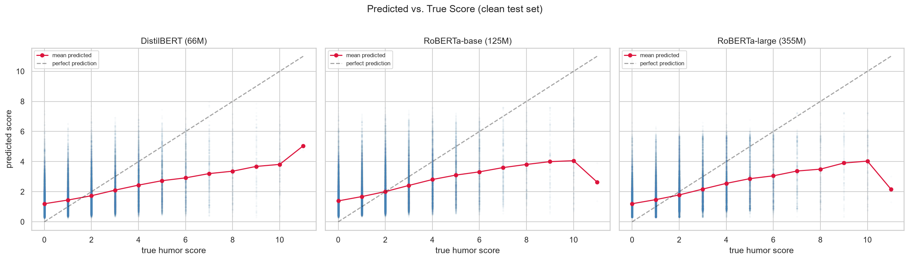
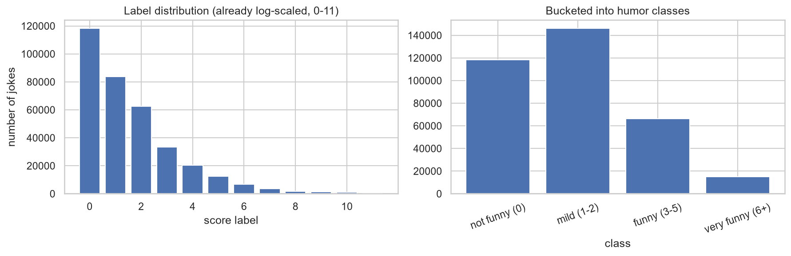
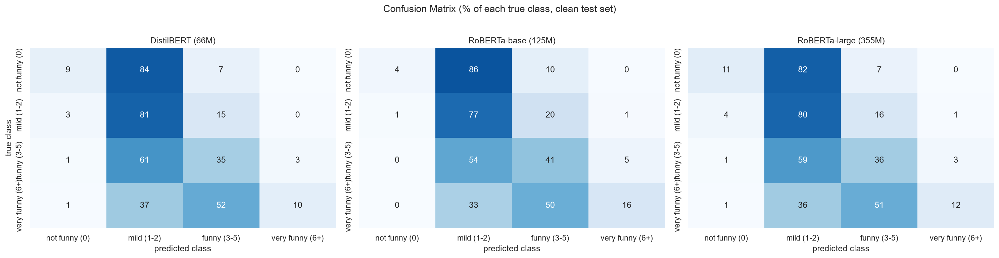

# Humor Intelligence

Predicting how funny a joke is, trained on 340k+ cleaned Reddit jokes, evaluated
against the published rJokes benchmark with a cross-split leakage finding.

A fine-tuned RoBERTa-large reaches Spearman **0.432** on a leakage-cleaned test
set, and **0.440** on the leaked evaluation the prior paper used exceeding
their reported 0.435. Three models form a ladder from a classical baseline
through a distilled transformer to a full-sized encoder, all trained under one
protocol so the comparison is controlled.

Everything runs on free compute (Kaggle T4 GPUs). All trained models are public
on the Hugging Face Hub.

**Status:** v1 complete. Models trained, published, and analyzed. Multi-seed
study planned.

---

## Headline results

Evaluated on the **leakage-cleaned** test set (41,957 examples). The prior
paper (Weller & Seppi, 2020) evaluates on a test set that contains ~2.4%
cross-split leakage; on that same leaked condition, our best model exceeds
their numbers.

| Model | Params | Clean Spearman | Clean Pearson | Clean RMSE |
|---|---|---|---|---|
| TF-IDF + Ridge | — | 0.363 | 0.414 | 1.645 |
| DistilBERT | 66M | 0.412 | 0.451 | 1.643 |
| RoBERTa-base | 125M | 0.419 | 0.451 | 1.705 |
| **RoBERTa-large** | **355M** | **0.432** | **0.470** | **1.630** |
| roBERTa-large (paper) | 355M | 0.435 | 0.474 | 1.614 |

On the leaked evaluation (paper's condition), RoBERTa-large scores **0.440 /
0.478**, surpassing the paper. The ~0.003 gap on clean eval is attributable to
leakage inflation in the paper's results, not to model quality.



### Models on the Hugging Face Hub

| Model | Hub link |
|---|---|
| DistilBERT (128 tokens) | [iamahmadyasin/humor-distilbert](https://huggingface.co/iamahmadyasin/humor-distilbert) |
| RoBERTa-base (128 tokens) | [iamahmadyasin/humor-roberta-base](https://huggingface.co/iamahmadyasin/humor-roberta-base) |
| RoBERTa-large (128 tokens) | [iamahmadyasin/humor-roberta-large](https://huggingface.co/iamahmadyasin/humor-roberta-large) |

---

## Dataset

**rJokes** (Weller & Seppi, LREC 2020) is a collection of 573k Reddit r/Jokes
posts spanning 2008–2019. The authors filtered this to ~432k jokes for the humor
prediction task, providing pre-split train/dev/test sets with community-derived
humor scores.

- Paper: https://aclanthology.org/2020.lrec-1.753/
- Data source: https://github.com/orionw/rJokesData

### The label is already log-scaled

The `score` column is not the raw Reddit upvote count. The dataset authors
applied `round(ln(raw_score + 1))`, compressing raw scores (which peak at
~136k upvotes) into integers 0–11 (the paper reports 0–10; labels of 11 are
rare but present in the data). This is used directly as the regression target
without log-transforming again.



### Data cleaning

Manual inspection surfaced three issues that automated pipelines would miss:

- **Exact duplicates:** 5,707 Reddit reposts removed from train.
- **Ultra-short fragments:** title-only junk under 5 words removed (a higher
  threshold would delete legitimate one-line puns).
- **Cross-split leakage:** ~2.4% of dev/test jokes are exact copies of training
  jokes. Evaluating on them tests memorization, not generalization. All
  overlapping rows were removed from dev/test. This leakage is present in the
  original paper's evaluation. I quantify its impact below.

Cleaned splits: **339,499 train / 41,941 dev / 41,957 test.**

### Cross-split leakage

The original rJokes splits contain ~2.4% overlap between train and test:

| Split | Leaked rows | Leak rate |
|---|---|---|
| Dev | 1,044 | 2.4% |
| Test | 1,061 | 2.5% |

These are Reddit reposts that landed in both splits. The prior paper does not
remove them. We evaluate every model on both the clean and leaked test sets,
so the comparison to the paper is fair, and the inflation from leakage is
measured rather than assumed. The impact is real but small: ~0.008 Spearman
on average across models.

---

## Approach

Three stages, each building on the last so every result has a reference point.

### 1. TF-IDF + Ridge baseline

A classical baseline establishes the floor. Tuning revealed that vocabulary
capping (common practice to limit memory) costs real accuracy here. Uncapped
TF-IDF with `min_df=5` reached Spearman 0.363, a meaningful jump over a
naively capped 20k-feature version (0.302), at negligible memory cost because
the feature matrix is sparse.

### 2. Fine-tuned transformers

Three transformer models with regression heads (`num_labels=1`,
`problem_type="regression"`), forming a ladder of increasing capacity:

| Model | Parameters | Role |
|---|---|---|
| DistilBERT | 66M | Lightweight rung — half the size of RoBERTa-base, within 0.007 Spearman |
| RoBERTa-base | 125M | Modern mid-size encoder |
| RoBERTa-large | 355M | Matches the paper's model class |

All three were trained under a single, fixed protocol so their scores are
directly comparable:

- 5 epochs, best checkpoint by dev Spearman
- Effective batch size 32 (constant across 1-GPU and 2-GPU setups)
- Learning rate 2e-5, 6% linear warmup, weight decay 0.01
- Max sequence length 128 tokens
- fp16 mixed precision
- Seed 42

### 3. Evaluation and analysis

All models are evaluated through one standardized harness (`src/evaluate.py`)
on three test-set variants: clean (leakage removed), leaky (paper's condition),
and leaked-only (just the overlapping rows). The evaluation notebooks
(`05_evaluation.ipynb`, `07_results_and_error_analysis.ipynb`) produce the
official results and figures.

---

## Key findings

### The model beats the paper on a fair comparison

On the leaked evaluation (matching the paper's condition), RoBERTa-large scores
Spearman **0.440** vs the paper's **0.435**. On the clean evaluation (leakage
removed), it scores **0.432**. The remaining gap is the measured leakage
inflation.

### Regression to the mean

All models compress predictions into the 1–5 range and never confidently predict
the extremes (0 or 6+). This is expected for MSE regression on an imbalanced,
noisy target as the model hedges toward the safe middle because confident extreme
predictions are punished heavily when the noisy label disagrees.



### Label noise as a performance ceiling

The worst model errors fall into two groups: label noise (jokes the model rates
highly but scored 0, often with signs the label is wrong) and hard to parse
humor (short, culturally specific one-liners). The overlap of worst errors
across models is high, confirming these are primarily dataset-level issues rather than
model-specific weaknesses.

### Model capacity helps, but with diminishing returns

DistilBERT (66M) gets surprisingly close to RoBERTa-large (355M): Spearman
0.412 vs 0.432, a gap of 0.020 for 5× the parameters. DistilBERT also has
better RMSE (1.643 vs 1.630). It calibrates magnitudes better despite ranking
slightly worse.

---

## Project structure

```
humor-intelligence/
├── notebooks/
│   ├── 01_eda.ipynb                       # exploratory data analysis
│   ├── 02_cleaning_and_leakage.ipynb      # cleaning pipeline + leakage discovery
│   ├── 03_baseline.ipynb                  # TF-IDF + Ridge baseline
│   ├── 04_finetune.ipynb                  # unified transformer training
│   ├── 05_evaluation.ipynb                # standardized eval
│   └── 07_results_and_error_analysis.ipynb # figures, confusion matrices, error analysis
├── src/
│   ├── config.py                          # paths and constants
│   ├── data.py                            # download, clean, build processed splits
│   ├── baseline.py                        # TF-IDF + Ridge baseline
│   ├── train.py                           # unified fine-tuning
│   └── evaluate.py                        # evaluation harness
├── results/
│   ├── all_metrics.csv                    # official metrics for all models × all eval sets
│   └── predictions_*.csv                  # per-model predictions for downstream analysis
├── reports/
│   └── figures/                           # committed charts
├── data/
│   ├── raw/                               # original downloaded data (gitignored)
│   └── processed/                         # cleaned splits (gitignored)
├── models/                                # local checkpoints (gitignored)
├── PROJECT_LOG.md                         # engineering narrative
├── SUMMARY.md                             # portfolio-facing write-up
└── README.md
```

---

## Setup

### Local (CPU) — data, EDA, baseline, analysis

```bash
# clone and set up
git clone https://github.com/iamahmadyasin/humor-intelligence.git
cd humor-intelligence
python -m venv venv
.\venv\Scripts\Activate.ps1
pip install -r requirements.txt
python -m ipykernel install --user --name humor-intelligence

# download and clean the dataset
python src/data.py

# run the baseline
python src/baseline.py

# launch notebooks
jupyter notebook
```

### GPU

The training notebook (`04_finetune.ipynb`) clones this repo, rebuilds the
cleaned data, trains, and pushes the model to the Hugging Face Hub. Model
weights are not committed to git.

On Kaggle: set Accelerator → GPU T4 ×2, Internet → On, add a `HF_TOKEN` secret
with your Hugging Face write token. Use Save & Run All (Commit) for
unattended execution.

**Multi-GPU note:** effective batch size = per-device batch × GPUs ×
gradient accumulation. The training script (`src/train.py`) adjusts
automatically to keep the effective batch at 32 regardless of GPU count.
This removes the multi-GPU confound that can silently change the number
of gradient updates.

---

## Task & evaluation

**Regression** on the 0–11 humor label, evaluated with **Spearman correlation**
(primary), **Pearson correlation**, and **RMSE**. Spearman is the headline metric
for ranking performance while RMSE measures magnitude calibration. Both are reported
for every model.

All models are evaluated through a single harness (`src/evaluate.py`) on three
test-set variants to separate model quality from dataset artifacts.

---

## Limitations

- Humor is subjective and the labels reflect one Reddit community's preferences,
  shaped by timing and virality as much as joke quality.
- The models regress to the mean and are unreliable at the extremes of the
  score range.
- The 128-vs-256 token comparison and the multi-seed significance study are
  planned but not yet completed. Current results are single-seed.
- These are humor rankers, not judges of objective funniness i.e. appropriate
  for research and demos, not high-stakes use.

---

## Citation

If you use this work, please cite the dataset paper:

```bibtex
@inproceedings{weller-seppi-2020-rjokes,
    title     = "The rJokes Dataset: a Large Scale Humor Collection",
    author    = "Weller, Orion and Seppi, Kevin",
    booktitle = "Proceedings of the 12th Language Resources and Evaluation Conference (LREC)",
    year      = "2020",
    pages     = "6136--6141",
    url       = "https://aclanthology.org/2020.lrec-1.753/",
}
```

## License / data use

Jokes are from Reddit under the Reddit User Agreement; see the dataset source.
This repo does not redistribute the data. It is downloaded on setup.
